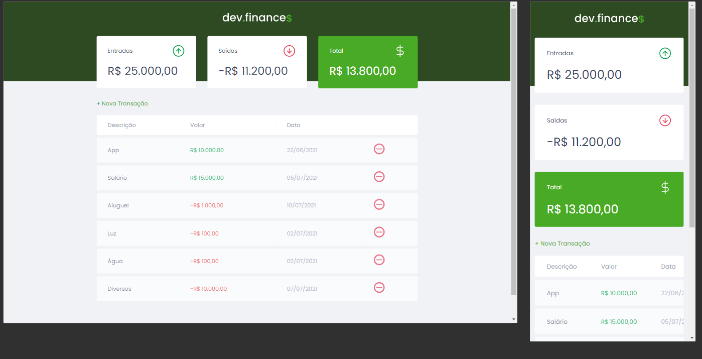

  

<!-- <h2 align="center">
🚧 DevFinances 2.0 | Em Construção 🚧
</h2> -->
 
 

  ![BADGE_OPEN_ISSUES] ![BADGE_CLOSED_ISSUES] ![BADGE_STARS] ![BADGE_FORKS]

<!-- Badges -->

[BADGE_CLOSED_ISSUES]: https://img.shields.io/github/issues-closed/marcelo-rafael/maratona-discover-01-dev-finances?color=blue

[BADGE_OPEN_ISSUES]: https://img.shields.io/github/issues/marcelo-rafael/maratona-discover-01-dev-finances?color=blue

[BADGE_STARS]: https://img.shields.io/github/stars/marcelo-rafael/maratona-discover-01-dev-finances?style=social

[BADGE_FORKS]: https://img.shields.io/github/forks/marcelo-rafael/maratona-discover-01-dev-finances?style=social

  
  
  

  
  
  
  
  
  
  
  

<h1 align="center">
  Bem Vindo ao DevFinances
</h1>

  

### 🚀 Sobre o Projeto

O DevFinances é uma aplicação de controle financeiro, onde é possível cadastrar e excluir transações e ver o saldo de entrada e saída 💰

---

## ⚙️ Funcionalidades

- Site para administrar ganhos e gastos (controle financeiro)
- Cadastro e exclusão de transações
- Visualização do saldo de entrada e saída.
---

### 🎨 Layout

O layout da aplicação está disponível no Figma:

Design feito por [Tiago Luchtenberg](https://www.instagram.com/tiagoluchtenberg/)

---

### Web e Mobile

<h4 align="center">
  
</h4>

---

## 🚀 Como executar o projeto

### Pré-requisitos

Antes de começar, você vai precisar ter instalado em sua máquina as seguintes ferramentas:
[Git](https://git-scm.com), [Node.js](https://nodejs.org/en/). 
Além disto é bom ter um editor para trabalhar com o código como [VSCode](https://code.visualstudio.com/)

---
    
## 🛠 Tecnologias:

Esse projeto foi desenvolvido com as seguintes tecnologias:

- **HTML**
- **CSS**
- **JavaScript**

---

## 💪 Como contribuir para o projeto

1. Faça um **fork** do projeto.
2. Crie uma nova branch com as suas alterações: `git checkout -b my-feature`
3. Salve as alterações e crie uma mensagem de commit contando o que você fez: `git commit -m "feature: My new feature"`
4. Envie as suas alterações: `git push origin my-feature`

> Caso tenha alguma dúvida confira este [guia de como contribuir no GitHub](https://github.com/firstcontributions/first-contributions)

---

# :man: Autor

## 🔗 Links

---

## **:page_with_curl: LICENÇA**

Esse repositório está licenciado pela **MIT LICENSE**. Para mais informações detalhadas, leia o arquivo [LICENSE](./LICENSE) contido nesse repositório. 

<h3 align="center">
Feito com ❤️ por <a href="https://www.linkedin.com/in/marcelo-rafael-goncalves/">Marcelo Rafael Gonçalves 💜🚀</a>
</h3>

